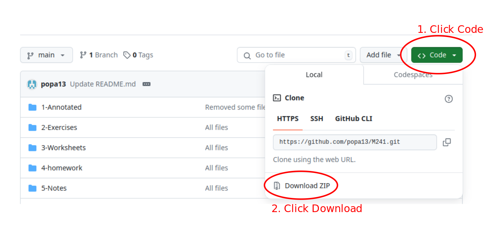

# A note to the viewer
You will find all the resources that I created while teaching Calculus I (M241) at the University of Hawai'i at Manoa. You can see below a screenshot of the home page of the website I created for the class. The website can be accessed through this link: [https://mathopo.ca/courses-website/math-241/math-241](https://mathopo.ca/courses-website/math-241/math-241).

In the following note, I describe in more details each section of the website.

## Home Page 
The Home page is the main page where all of the information for the class is available. The important documents such as the syllabus, the study guide, and some resources are available. Also, the day and time when we meet and the location is also shown using a google map. 

## Schedule
The Schedule page was created to track the assignments, midterms, and lecture meetings. I used a google calendar and share it with the student so they can link it to their phone.

## Lecture Notes
The Lecture Notes page was the most important one. This is where the students could download the lectures notes to annotate them in class. After the lecture, I uploaded the annotated lecture notes completed during lecture that day. You can either find the lecture notes in the files in this github repository or go download them from the course website directly. Whatever option you prefer :) 

To organize the content of this webpage, I used tables as pictured below.

Each table has the Chapter number as a title and contains all the material for that chapter. 
- The first column is the section number of the chapter.
- The second column is the pdf for the lecture notes (no annotations).
- The third column is the pdf for the updated annotated lecture notes.
- The fourth column is the pdf of the exercises to complete.
- The fifth column is the pdf of the solutions to the exercises.

The only exception to that format was the first table of the Lecture Notes webpage. This table contains pre-requisite materials from pre-calculus. You can check it out!

## Homework
The Homework webpage explains the format of the homework. I decided to give multi-choices tests to the students as homework. The questions on the tests were correlated with the lectures. So, once in a while, there would be a question about something I would say, that you might not find online. This was my way to track who was attending the lectures ;) 

I won't explain more, just go read the text on that webpage. It will be selfexplainatory. 

## Final Prep
The Final Prep webpage contains solutions to finals from previous years. I also shared the solutions to the Concept Checks from the textbook. 

## How I taught the class
I would start off the semester by handing out sections 1.1, 1.2, and 1.3 to the students. I will ask them to complete that on their own in class and ask them to submit their completed work for the first homework. 

Starting on the second week, I would start lecturing using the lecture notes templates provided in the Lecture Notes webpage. The students were responsible of printing or downloading the lecture notes template from the course website. In class, I would have a wacom tablet connected to my laptop and I would fill in the lecture notes while I lecture. Those notes were projected with a projector, so that the students can see all my notes during lecture. 

Every week, there was a recitation lead by a teaching assistant. During these recitations, the students were asked to work on the exercises. I also asked the teaching assistant to take attendance. I used this to give extra points to students with a good attendance rate. At the end of the recitation, we released the homework assignment on the LMS which was due for the next Monday. To see the homework, check out the Homework file in this repository. Unfortunately, there are not on the course website.

There were two common midterms and one common final. The final exam questions were on all the material covered during the semester. So, it is a very demanding exam for the students and providing all the ressources they need to succeed is very important. You should get in contact with Curly (ask around, and they will tell you) for helping organizing the MathJam!

Also, after presenting Newton's method, I like to show the following [video](https://www.youtube.com/watch?v=-RdOwhmqP5s) from 3Blue1Brown. I really like this video because it shows students that mathematics is not just about methodic calculations, but can be related to art. A whole lecture is usually dedicated to that video. I also take the opportunity to explain what is a complex number so they can understand more easily what's in the video.

I hope this will help you plan you class. 

# Final remarks
All the pictures used in the lecture notes are from the main textbook used at UH Manoa *Calculus* by James Stuart. 

If you want to download all the files from this repository as a .zip on your computer, follow the steps illustrated in the picutre below.

# Contat Info
You can reach me by email parisepierreolivier@gmail.com if you have any questions or if you would like to add your own contributions.
Best of luck!

